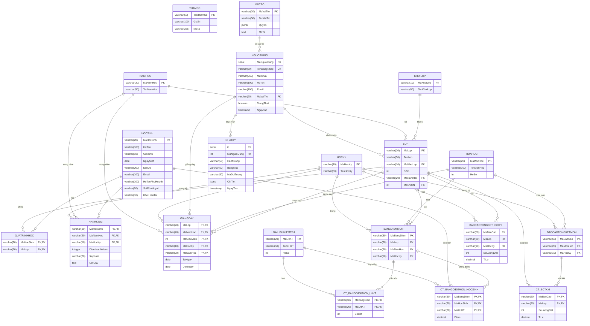

# Sơ đồ Logic Database - Hệ thống Quản Lý Học Sinh

## 📊 Tổng quan hệ thống

Hệ thống quản lý học sinh bao gồm **20 bảng** được chia thành các nhóm chức năng:
- **Quản lý cơ bản**: Năm học, Học kỳ, Khối lớp, Lớp
- **Quản lý học sinh**: Học sinh, Quá trình học, Hạnh kiểm
- **Quản lý giảng dạy**: Giảng dạy (phân công GV)
- **Quản lý môn học và điểm**: Môn học, Loại hình kiểm tra, Bảng điểm
- **Báo cáo**: Báo cáo tổng kết môn, Báo cáo tổng kết học kỳ
- **Hệ thống**: Tham số, Vai trò, Người dùng, Nhật ký

---

## 🎨 Sơ đồ Mermaid Entity Relationship Diagram



---

## 🗂️ Code cho DBDiagram.io

Truy cập [https://dbdiagram.io/](https://dbdiagram.io/) và paste code sau:

```dbml
// =============================================
// DATABASE: Hệ thống Quản lý Học sinh
// =============================================

// ========== BẢNG CƠ BẢN ==========
Table NAMHOC {
  MaNamHoc varchar(20) [pk, note: 'Mã năm học']
  TenNamHoc varchar(50) [not null, note: 'Tên năm học']
  
  Note: 'Quản lý các năm học'
}

Table HOCKY {
  MaHocKy varchar(10) [pk, note: 'Mã học kỳ']
  TenHocKy varchar(50) [not null, note: 'Tên học kỳ']
  
  Note: 'Học kỳ 1 và Học kỳ 2'
}

Table KHOILOP {
  MaKhoiLop varchar(10) [pk, note: 'Mã khối lớp']
  TenKhoiLop varchar(50) [not null, note: 'Tên khối lớp']
  
  Note: 'Khối 10, 11, 12'
}

Table LOP {
  MaLop varchar(20) [pk, note: 'Mã lớp']
  TenLop varchar(50) [not null, note: 'Tên lớp']
  MaKhoiLop varchar(10) [ref: > KHOILOP.MaKhoiLop, note: 'Thuộc khối']
  SiSo int [default: 0, note: 'Sĩ số hiện tại']
  MaNamHoc varchar(20) [ref: > NAMHOC.MaNamHoc, note: 'Năm học']
  MaGVCN int [ref: > NGUOIDUNG.MaNguoiDung, note: 'Giáo viên chủ nhiệm']
  
  Indexes {
    MaKhoiLop
    MaNamHoc
    MaGVCN
  }
  
  Note: 'Danh sách các lớp học'
}

// ========== GIẢNG DẠY ==========
Table GIANGDAY {
  MaLop varchar(20) [pk, ref: > LOP.MaLop]
  MaMonHoc varchar(20) [pk, ref: > MONHOC.MaMonHoc]
  MaGiaoVien int [pk, ref: > NGUOIDUNG.MaNguoiDung]
  MaHocKy varchar(10) [pk, ref: > HOCKY.MaHocKy]
  MaNamHoc varchar(20) [pk, ref: > NAMHOC.MaNamHoc]
  TuNgay date [note: 'Ngày bắt đầu']
  DenNgay date [note: 'Ngày kết thúc']
  
  Indexes {
    (MaLop, MaMonHoc, MaGiaoVien, MaHocKy, MaNamHoc) [pk]
  }
  
  Note: 'Phân công giáo viên dạy lớp-môn theo học kỳ'
}

// ========== HỌC SINH ==========
Table HOCSINH {
  MaHocSinh varchar(20) [pk, note: 'Mã học sinh (HS01XXXX)']
  HoTen varchar(100) [not null, note: 'Họ và tên']
  GioiTinh varchar(10) [note: 'Nam/Nữ']
  NgaySinh date [note: 'Ngày sinh']
  DiaChi varchar(200) [note: 'Địa chỉ']
  Email varchar(100) [note: 'Email liên hệ']
  HoTenPhuHuynh varchar(100) [note: 'Họ tên phụ huynh']
  SdtPhuHuynh varchar(20) [note: 'SĐT phụ huynh']
  KhoiHienTai varchar(10) [note: 'Khối hiện tại: K10, K11, K12']
  
  Note: 'Thông tin học sinh (phụ huynh chỉ là thông tin liên hệ)'
}

Table QUATRINHHOC {
  MaHocSinh varchar(20) [pk, ref: > HOCSINH.MaHocSinh]
  MaLop varchar(20) [pk, ref: > LOP.MaLop]
  
  Indexes {
    (MaHocSinh, MaLop) [pk]
  }
  
  Note: 'Lịch sử học tập của học sinh (học sinh thuộc lớp nào)'
}

Table HANHKIEM {
  MaHocSinh varchar(20) [pk, ref: > HOCSINH.MaHocSinh]
  MaNamHoc varchar(20) [pk, ref: > NAMHOC.MaNamHoc]
  MaHocKy varchar(10) [pk, ref: > HOCKY.MaHocKy]
  DiemHanhKiem integer [note: 'Điểm hạnh kiểm (0-100)']
  XepLoai varchar(20) [note: 'Tốt/Khá/Trung bình/Yếu']
  GhiChu text [note: 'Ghi chú']
  
  Indexes {
    (MaHocSinh, MaNamHoc, MaHocKy) [pk]
  }
  
  Note: 'Hạnh kiểm học sinh theo học kỳ (điểm >=80: Tốt, >=65: Khá, >=50: TB, <50: Yếu)'
}

// ========== MÔN HỌC ==========
Table MONHOC {
  MaMonHoc varchar(20) [pk, note: 'Mã môn học']
  TenMonHoc varchar(100) [not null, note: 'Tên môn học']
  HeSo int [default: 1, note: 'Hệ số môn học']
  
  Note: 'Danh sách các môn học'
}

Table LOAIHINHKIEMTRA {
  MaLHKT varchar(20) [pk, note: 'Mã loại hình kiểm tra']
  TenLHKT varchar(50) [not null, note: 'Tên loại hình']
  HeSo int [default: 1, note: 'Hệ số (15P=1, GK=2, CK=3)']
  
  Note: 'Các loại kiểm tra: 15 phút (max 4 cột), Giữa kỳ (1 cột), Cuối kỳ (1 cột)'
}

// ========== BẢNG ĐIỂM ==========
Table BANGDIEMMON {
  MaBangDiem varchar(50) [pk, note: 'Mã bảng điểm']
  MaLop varchar(20) [ref: > LOP.MaLop, note: 'Lớp']
  MaMonHoc varchar(20) [ref: > MONHOC.MaMonHoc, note: 'Môn học']
  MaHocKy varchar(10) [ref: > HOCKY.MaHocKy, note: 'Học kỳ']
  
  Indexes {
    (MaLop, MaMonHoc, MaHocKy)
  }
  
  Note: 'Bảng điểm của một lớp trong một môn học và học kỳ'
}

Table CT_BANGDIEMMON_LHKT {
  MaBangDiem varchar(50) [pk, ref: > BANGDIEMMON.MaBangDiem]
  MaLHKT varchar(20) [pk, ref: > LOAIHINHKIEMTRA.MaLHKT]
  SoCot int [default: 1, note: 'Số cột điểm']
  
  Indexes {
    (MaBangDiem, MaLHKT) [pk]
  }
  
  Note: 'Cấu trúc bảng điểm: mỗi bảng có những loại kiểm tra nào'
}

Table CT_BANGDIEMMON_HOCSINH {
  MaBangDiem varchar(50) [pk, ref: > BANGDIEMMON.MaBangDiem]
  MaHocSinh varchar(20) [pk, ref: > HOCSINH.MaHocSinh]
  MaLHKT varchar(20) [pk, ref: > LOAIHINHKIEMTRA.MaLHKT]
  Diem decimal(4,2) [note: 'Điểm số (0-10)']
  
  Indexes {
    (MaBangDiem, MaHocSinh, MaLHKT) [pk]
  }
  
  Note: 'Chi tiết điểm của từng học sinh theo loại kiểm tra'
}

// ========== BÁO CÁO ==========
Table BAOCAOTONGKETMON {
  MaBaoCao varchar(50) [pk, note: 'Mã báo cáo']
  MaMonHoc varchar(20) [ref: > MONHOC.MaMonHoc, note: 'Môn học']
  MaHocKy varchar(10) [ref: > HOCKY.MaHocKy, note: 'Học kỳ']
  
  Indexes {
    (MaMonHoc, MaHocKy)
  }
  
  Note: 'Báo cáo tổng kết môn học theo học kỳ'
}

Table CT_BCTKM {
  MaBaoCao varchar(50) [pk, ref: > BAOCAOTONGKETMON.MaBaoCao]
  MaLop varchar(20) [pk, ref: > LOP.MaLop]
  SoLuongDat int [default: 0, note: 'Số HS đạt']
  TiLe decimal(5,2) [default: 0, note: 'Tỷ lệ đạt (%)']
  
  Indexes {
    (MaBaoCao, MaLop) [pk]
  }
  
  Note: 'Chi tiết báo cáo tổng kết môn theo từng lớp'
}

Table BAOCAOTONGKETHOCKY {
  MaBaoCao varchar(50) [pk, note: 'Mã báo cáo']
  MaLop varchar(20) [ref: > LOP.MaLop, note: 'Lớp']
  MaHocKy varchar(10) [ref: > HOCKY.MaHocKy, note: 'Học kỳ']
  SoLuongDat int [default: 0, note: 'Số HS đạt']
  TiLe decimal(5,2) [default: 0, note: 'Tỷ lệ đạt (%)']
  
  Indexes {
    (MaLop, MaHocKy)
  }
  
  Note: 'Báo cáo tổng kết học kỳ của từng lớp'
}

// ========== HỆ THỐNG ==========
Table THAMSO {
  TenThamSo varchar(50) [pk, note: 'Tên tham số']
  GiaTri varchar(100) [note: 'Giá trị']
  MoTa varchar(255) [note: 'Mô tả']
  
  Note: 'Các tham số: tuổi (15-20), sĩ số (40), điểm đạt (5), max HS (999/khóa, 1600 hệ thống), max cột TX (4), ngưỡng hạnh kiểm'
}

Table VAITRO {
  MaVaiTro varchar(20) [pk, note: 'Mã vai trò']
  TenVaiTro varchar(50) [not null, note: 'Tên vai trò']
  Quyen jsonb [default: '{}', note: 'Quyền hạn (JSON)']
  MoTa text [note: 'Mô tả vai trò']
  
  Note: 'Vai trò: ADMIN, GVCN, GVBM, STUDENT (đã bỏ PARENT)'
}

Table NGUOIDUNG {
  MaNguoiDung serial [pk, note: 'ID tự động']
  TenDangNhap varchar(50) [unique, not null, note: 'Username']
  MatKhau varchar(255) [not null, note: 'Password (hashed)']
  HoTen varchar(100) [note: 'Họ tên']
  Email varchar(100) [note: 'Email']
  MaVaiTro varchar(20) [ref: > VAITRO.MaVaiTro, note: 'Vai trò']
  TrangThai boolean [default: true, note: 'Active/Inactive']
  NgayTao timestamp [default: `CURRENT_TIMESTAMP`, note: 'Ngày tạo']
  
  Indexes {
    TenDangNhap [unique]
    MaVaiTro
  }
  
  Note: 'Tài khoản người dùng hệ thống'
}

Table NHATKY {
  id serial [pk, note: 'ID tự động']
  MaNguoiDung int [ref: > NGUOIDUNG.MaNguoiDung, note: 'Người thực hiện']
  HanhDong varchar(50) [not null, note: 'Hành động (CREATE, UPDATE, DELETE...)']
  BangMuc varchar(50) [note: 'Bảng bị tác động']
  MaDoiTuong varchar(50) [note: 'Mã đối tượng bị thao tác']
  ChiTiet jsonb [note: 'Chi tiết thay đổi (JSON)']
  NgayTao timestamp [default: `CURRENT_TIMESTAMP`, note: 'Thời gian']
  
  Indexes {
    MaNguoiDung
    NgayTao
  }
  
  Note: 'Nhật ký audit log - ghi lại các thao tác quan trọng trong hệ thống'
}

// ========== GHI CHÚ QUAN HỆ ==========
// Ref: LOP.MaKhoiLop > KHOILOP.MaKhoiLop [note: "Lớp thuộc khối"]
// Ref: LOP.MaNamHoc > NAMHOC.MaNamHoc [note: "Lớp trong năm học"]
// Ref: QUATRINHHOC.MaHocSinh > HOCSINH.MaHocSinh [note: "HS học lớp"]
// Ref: QUATRINHHOC.MaLop > LOP.MaLop [note: "Lớp chứa HS"]
```

---

## 📋 Danh sách các bảng

### 1. **Bảng Quản lý cơ bản** (4 bảng)
- `NAMHOC`: Quản lý năm học
- `HOCKY`: Học kỳ 1, Học kỳ 2
- `KHOILOP`: Khối 10, 11, 12
- `LOP`: Danh sách các lớp học

### 2. **Bảng Học sinh** (3 bảng)
- `HOCSINH`: Thông tin học sinh (bao gồm thông tin phụ huynh)
- `QUATRINHHOC`: Lịch sử học tập (học sinh thuộc lớp nào)
- `HANHKIEM`: Hạnh kiểm học sinh theo học kỳ và năm học

### 3. **Bảng Giảng dạy** (1 bảng)
- `GIANGDAY`: Phân công giáo viên dạy lớp-môn theo học kỳ

### 4. **Bảng Môn học và Điểm** (6 bảng)
- `MONHOC`: Danh sách môn học
- `LOAIHINHKIEMTRA`: Các loại kiểm tra (15p, GK, CK)
- `BANGDIEMMON`: Bảng điểm của lớp-môn-học kỳ
- `CT_BANGDIEMMON_LHKT`: Cấu trúc bảng điểm (có những loại kiểm tra nào)
- `CT_BANGDIEMMON_HOCSINH`: Chi tiết điểm của từng học sinh
- `BAOCAOTONGKETMON`: Báo cáo tổng kết môn

### 5. **Bảng Báo cáo** (2 bảng)
- `CT_BCTKM`: Chi tiết báo cáo tổng kết môn theo lớp
- `BAOCAOTONGKETHOCKY`: Báo cáo tổng kết học kỳ

### 6. **Bảng Hệ thống** (4 bảng)
- `THAMSO`: Cấu hình hệ thống (tuổi, sĩ số, điểm đạt, số HS tối đa...)
- `VAITRO`: Vai trò người dùng (Admin, GVCN, GVBM, Student)
- `NGUOIDUNG`: Tài khoản người dùng
- `NHATKY`: Nhật ký audit log (ghi lại các thao tác quan trọng)

**Tổng cộng: 20 bảng**

---

## 🔑 Các ràng buộc và quy tắc nghiệp vụ

### Quy định về tuổi
- Tuổi tối thiểu: **15 tuổi**
- Tuổi tối đa: **20 tuổi**

### Quy định về lớp học
- Mỗi năm học có **2 học kỳ**
- Sĩ số tối đa mỗi lớp: **40 học sinh**
- Có 3 khối lớp: **10, 11, 12**

### Quy định về điểm số
- Thang điểm: **0 đến 10**
- Điểm đạt môn: **≥ 5.0**
- Cấu trúc điểm mỗi môn:
  - Kiểm tra 15 phút (15P): **Hệ số 1**, tối đa **4 cột** (có thể 0-4 cột)
  - Giữa kỳ (GK): **Hệ số 2**, **bắt buộc 1 cột**
  - Cuối kỳ (CK): **Hệ số 3**, **bắt buộc 1 cột**
- Công thức tính điểm:
  - **TB môn HK** = (Σ điểm 15P × 1 + GK × 2 + CK × 3) / (Số cột 15P + 2 + 3)
  - **TB môn cả năm** = (TB HK1 + TB HK2 × 2) / 3

### Quy định về học sinh
- Mã học sinh: **HS01XXXX** (4 chữ số, số đầu phải là 0)
  - Ví dụ: HS010000, HS010001, ..., HS011599
- Max học sinh một khóa: **999 HS**
- Max học sinh toàn hệ thống: **1600 HS**
- Phụ huynh: Chỉ là **thông tin liên hệ**, không có tài khoản đăng nhập

### Quy định về hạnh kiểm
- Thang điểm: **0-100** (số nguyên)
- Xếp loại:
  - **Tốt**: ≥ 80 điểm
  - **Khá**: 65-79 điểm
  - **Trung bình**: 50-64 điểm
  - **Yếu**: < 50 điểm
- Nhập theo học kỳ (HK1, HK2)
- Hạnh kiểm cả năm phụ thuộc vào HK1 và HK2

### Quy định về môn học
- Có **9 môn học**: Toán, Văn, Anh, Lý, Hóa, Sinh, Sử, Địa, GDCD
- Mỗi môn có hệ số riêng (1 hoặc 2)

### Quyền hạn người dùng
- **ADMIN**: Toàn quyền hệ thống, xem tất cả lớp, nhập hạnh kiểm cho tất cả
- **GVCN** (Giáo viên chủ nhiệm):
  - Nhập điểm môn mình dạy (theo bảng GIANGDAY)
  - Nhập hạnh kiểm lớp mình chủ nhiệm
  - Xem tổng kết lớp mình chủ nhiệm
  - Xem thông tin học sinh trong lớp
- **GVBM** (Giáo viên bộ môn):
  - Chỉ nhập điểm môn mình dạy (theo bảng GIANGDAY)
  - Không nhập hạnh kiểm
  - Không xem tổng kết lớp
- **STUDENT**: Xem điểm và hạnh kiểm của bản thân

### Quy định về giáo viên
- Tổng số giáo viên phải **> Số lớp**
- Mỗi lớp có **1 GVCN duy nhất**
- Mỗi GV (GVCN hoặc GVBM) chỉ nhập điểm lớp-môn được phân công trong bảng GIANGDAY

---

## 🔧 Các hàm hỗ trợ (Functions)

### 1. `fn_TinhTuoi(ngay_sinh DATE)`
Tính tuổi học sinh từ ngày sinh

### 2. `fn_KiemTraTuoi(ngay_sinh DATE)`
Kiểm tra tuổi có hợp lệ không (15-20)

### 3. `fn_TinhDiemTB(ma_bang_diem, ma_hoc_sinh)`
Tính điểm trung bình môn học kỳ có trọng số
- Công thức: TB HK = (Σ điểm × hệ số) / (Σ hệ số)

### 4. `fn_TinhDiemTBNam(ma_lop, ma_mon_hoc, ma_hoc_sinh, ma_nam_hoc)`
Tính điểm trung bình môn cả năm
- Công thức: TB Năm = (TB HK1 + TB HK2 × 2) / 3

### 5. `fn_KiemTraDatMon(diem_tb)`
Kiểm tra điểm có đạt môn không (≥5)

---

## 📊 View: V_QUIDINH

View hiển thị tóm tắt các quy định của hệ thống:
- QĐ1: Tuổi học sinh
- QĐ2: Số học kỳ
- QĐ3: Sĩ số tối đa
- QĐ5: Số môn học
- QĐ6: Thang điểm
- QĐ7: Điểm đạt môn

---

## 🚀 Hướng dẫn sử dụng

### Cách vẽ sơ đồ Mermaid trong Markdown
1. Copy code Mermaid ở trên
2. Paste vào file `.md` trong VS Code
3. Cài extension **Markdown Preview Mermaid Support**
4. Preview file để xem sơ đồ

### Cách vẽ sơ đồ trên DBDiagram.io
1. Truy cập [https://dbdiagram.io/](https://dbdiagram.io/)
2. Click **Go to App** (không cần đăng ký)
3. Xóa code mẫu
4. Paste code DBML ở trên
5. Sơ đồ sẽ tự động hiển thị
6. Export dưới dạng PNG, PDF, hoặc SQL

---

## 📝 Ghi chú

- Tất cả bảng đều sử dụng `CREATE TABLE IF NOT EXISTS` để tránh lỗi khi chạy lại
- Sử dụng `ON CONFLICT DO NOTHING` hoặc `DO UPDATE` để xử lý dữ liệu trùng lặp
- Các khóa ngoại có `ON DELETE CASCADE` để tự động xóa dữ liệu liên quan
- Check constraint đảm bảo điểm nằm trong khoảng 0-10
- JSONB được dùng để lưu quyền hạn linh hoạt

---

**Tác giả**: Generated by GitHub Copilot  
**Ngày tạo**: December 5, 2025  
**Phiên bản**: 1.0
